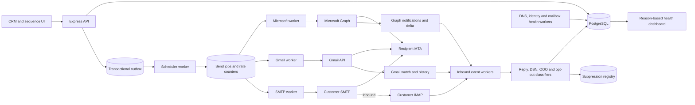
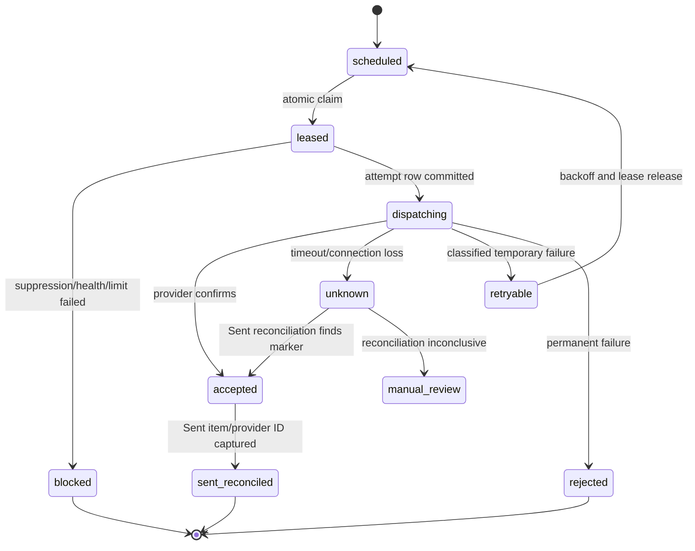

# Ideal connected-mailbox email architecture

## Decisive architecture

- **Microsoft 365:** Microsoft Graph with delegated OAuth per connected user mailbox. Normal sends use the authenticated mailbox. Shared-mailbox sending is a separately enabled capability requiring explicit `From`, `Mail.Send.Shared`, and verified Exchange **Send As** rights. Do not silently fall back to Send on Behalf.
- **Gmail / Google Workspace:** Gmail API with per-mailbox OAuth. Enumerate Gmail `sendAs` settings and permit only primary or verified identities.
- **Generic providers:** authenticated SMTP for outbound and IMAP for inbound. Prefer OAuth where the provider supports it. Passwords/app passwords are an explicit legacy mode.
- **POP3:** no initial support; add only as a clearly degraded inbound fallback when a customer has no IMAP/API option.
- **Outbound delivery:** provider-owned MTAs and IPs. TG Core owns reliable application egress, OAuth callbacks, dispatch, policy, correlation, and health—not a sending MTA.
- **Tracking:** off by default. Direct links and reply/positive-reply metrics are the baseline. Tracked links require explicit opt-in and a validated customer-branded domain.
- **Warmup:** no artificial warmup network. Use readiness checks and controlled gradual real sending.

## System boundaries



Run the API, scheduler, provider workers, and inbound workers as separately scalable Railway processes against the same database. Start with a PostgreSQL-backed durable queue and transactional outbox to avoid introducing Redis solely for this feature. Claims must be made through one database function using `FOR UPDATE SKIP LOCKED`, a lease expiry, and an attempt record. A later managed queue may carry wake-up events, but PostgreSQL remains the state and idempotency authority.

## Unified provider abstraction

The existing `server/src/lib/mail` router should evolve without discarding working adapters. The shared contract should operate on immutable mailbox/identity IDs rather than arbitrary email strings.

```ts
interface MailboxProvider {
  connectMailbox(input: ConnectInput): Promise<AuthorizationRedirect | CapabilityResult>;
  completeOAuthCallback(input: CallbackInput): Promise<MailboxConnection>;
  validateMailbox(mailboxId: string): Promise<MailboxValidation>;
  refreshAuth(mailboxId: string): Promise<AuthHealth>;
  revokeConnection(mailboxId: string): Promise<void>;
  getAuthorizedSenderIdentities(mailboxId: string): Promise<SenderIdentity[]>;
  validateFromIdentity(mailboxId: string, identityId: string): Promise<IdentityValidation>;
  sendMessage(job: CanonicalSendJob): Promise<ProviderAcceptance>;
  fetchMessage(mailboxId: string, providerId: string): Promise<CanonicalMessage>;
  fetchReplies(mailboxId: string, cursor?: string): Promise<SyncPage>;
  syncMailbox(mailboxId: string, cursor?: string): Promise<SyncResult>;
  startMailboxWatch(mailboxId: string): Promise<WatchState>;
  renewMailboxWatch(mailboxId: string): Promise<WatchState>;
  stopMailboxWatch(mailboxId: string): Promise<void>;
  fetchSentMessages(mailboxId: string, query: SentQuery): Promise<CanonicalMessage[]>;
  classifyInboundMessage(message: CanonicalMessage): Promise<InboundSignals>;
  detectBounce(message: CanonicalMessage): Promise<BounceResult | null>;
  getProviderHealth(mailboxId: string): Promise<ProviderHealth>;
  getProviderLimits(mailboxId: string): Promise<ProviderLimitSignals>;
  pauseMailbox(mailboxId: string, reason: PauseReason): Promise<void>;
  reconnectMailbox(mailboxId: string): Promise<AuthorizationRedirect | CapabilityResult>;
}
```

`ProviderAcceptance` must distinguish `accepted`, `rejected`, `throttled`, and `unknown`. It contains provider request/correlation IDs but never pretends a request ID is a message ID. `CanonicalSendJob` contains `jobId`, `mailboxId`, `senderIdentityId`, immutable recipient/template snapshots, compliance/suppression decision IDs, deterministic correlation token, and the expected conversation identifiers.

### Provider-owned behavior

- OAuth and token refresh/revocation; provider API and SMTP submission details.
- Mailbox and authorized identity discovery; alias/shared-mailbox rules.
- Message/folder/label IDs, thread IDs, delta/history cursors, webhook/watch lifecycle.
- Provider-specific throttling/error mapping, Sent behavior, DSN/message formats.
- Provider transport headers, DKIM application, envelope return path, and final outbound MTA.

### Shared application behavior

- Organizations, campaigns, sequences, enrollments, rendering, consent/compliance records.
- Global and tenant suppression, unsubscribe, bounce/reply classification policy.
- Scheduling, rate counters, idempotency, leases, retries, pause/cancellation.
- Health state, DNS checks, content warnings, audit logs, observability and admin controls.

## Microsoft 365 flow

```mermaid
sequenceDiagram
  participant U as User
  participant TG as TG Core
  participant E as Microsoft identity platform
  participant G as Microsoft Graph
  participant X as Exchange Online
  U->>TG: Connect Microsoft 365
  TG->>TG: Create state, PKCE verifier, tenant-bound connection intent
  TG->>E: Authorization code request (delegated least privilege)
  E-->>TG: Code with validated state
  TG->>E: Redeem code and bind tenant/user IDs
  TG->>G: GET /me and mailbox settings
  TG->>TG: Store grant reference; create primary sender identity
  TG->>G: Test draft/send to controlled diagnostic recipient
  G->>X: Submit as authenticated mailbox
  X-->>TG: Sent item/delta plus auth result from diagnostic mailbox
  TG->>TG: Mark identity ready only when From/Sender/auth align
```

Recommended delegated scope sets:

| Capability | Minimum direction | Notes |
|---|---|---|
| Send normal mailbox | `Mail.Send` | Per connected user. |
| Read/sync replies and Sent | `Mail.Read` | `Mail.ReadBasic` is insufficient for MIME/body/classification. Restricted data handling and least privilege still apply. |
| Create subscription on own mailbox | Same least-privilege message read scope required for the resource | Validate notification token/client state and lifecycle events. |
| Sync history | Message read scope plus per-folder delta cursors | Delta is recovery source of truth. |
| Send as shared/other identity | `Mail.Send.Shared` plus Exchange Send As or Send on Behalf | TG Core supports only explicit Send As by default; no silent downgrade. |
| Read shared mailbox | `Mail.Read.Shared` for direct delegated access | Microsoft documents shared/delegated notification limitations; real-time subscriptions can require application permission. |

The exact consent bundle should be split: connect with send-only if the customer only sends; request read access through incremental consent when inbox sync is enabled. Admin consent may be required by customer policy even for delegated scopes. Conditional Access and MFA are expected and must not be bypassed.

Persist Entra tenant ID, Graph user object ID, account type, primary SMTP address, grant ID, consented scopes, token expiry/refresh health, and validation evidence. For a shared mailbox, persist the shared mailbox object/address, delegate user ID, Exchange permission type, and explicit test result. Never infer Send As from a domain match or alias.

Graph notifications enqueue a mailbox sync; workers use delta cursors per folder. Renew subscriptions before expiry and process lifecycle/missed notifications. Poll delta periodically even with healthy webhooks. On an ambiguous send, do not automatically resend: reconcile the draft/Sent folder using the immutable job marker and time/recipient before deciding.

## Gmail / Google Workspace flow

Use Google OAuth authorization-code flow with offline access, exact state binding, PKCE where supported by the selected client type, and incremental scopes. External production apps need accurate consent-screen and verification artifacts.

1. Request `gmail.send` for sending.
2. If inbound synchronization is enabled, request the least Gmail read/modify scope that supports required behavior. Because read scopes are restricted, complete Google verification and any required security assessment before customer launch.
3. Fetch `users.settings.sendAs.list`. Record primary and verified aliases; hard-block pending/unverified aliases.
4. Send a controlled test from the selected identity. Fetch the sent message and inspect a diagnostic copy’s headers.
5. Create a Gmail watch to a dedicated Pub/Sub topic. Verify authenticated push delivery, enqueue by user/history ID, then call history API from the stored cursor.
6. Renew watches daily. If history is too old or a notification is missing, execute a bounded full resync. Store Gmail message ID and thread ID, RFC Message-ID, and history ID.

Service-account domain-wide delegation is not the default: it requires per-customer super-admin authorization, creates tenant-wide blast radius, and is unnecessary when each customer connects a mailbox. SMTP XOAUTH2 is a fallback for provider/API gaps, not the preferred Gmail implementation. App-password SMTP/IMAP is legacy and visibly labeled as such.

## Generic SMTP and IMAP flow

Connection discovery and validation must:

- normalize internationalized domains and reject control characters;
- resolve hosts through the SSRF guard on every new connection and periodically thereafter;
- require valid certificates, hostname verification, TLS 1.2 or later, and STARTTLS where applicable;
- detect advertised SMTP AUTH mechanisms and IMAP capabilities; prefer OAuth or modern mechanisms;
- test authentication without logging credentials or server challenge bodies;
- test that the authenticated account can send the exact selected `From` to a controlled sink, then inspect raw results;
- discover namespace, Sent folder using special-use flags rather than English names, and whether SMTP automatically copies Sent mail;
- persist mailbox ID, UIDVALIDITY, folder ID/name, last UID/mod-sequence, and capability snapshot;
- use IMAP IDLE where available and a periodic poll/reconciliation fallback;
- never advance a cursor until each message is committed or quarantined with a durable failure record.

POP3 downloads messages without folders, server-side threading/flags, robust incremental mailbox semantics, or Sent access. It is a poor sequencer foundation. If eventually offered, it must be inbound-only, use UIDL where stable, run a polling/reconciliation adapter, and be labeled “limited reply detection; no folder/thread guarantees.” Sending still requires SMTP.

## Outbound IP and infrastructure reality

| Send path | Submission from | Recipient-facing outbound MTA/IP | Who owns IP reputation and PTR | Who normally supplies DKIM/Return-Path |
|---|---|---|---|---|
| Microsoft Graph | TG Core HTTPS client | Exchange Online | Microsoft, with mailbox/domain reputation also material | Exchange Online |
| Microsoft SMTP AUTH | TG Core SMTP client | Exchange Online | Microsoft | Exchange Online |
| Gmail API | TG Core HTTPS client | Gmail | Google | Gmail/Workspace |
| Gmail SMTP submission | TG Core SMTP client | Gmail | Google | Gmail/Workspace |
| Generic SMTP | TG Core SMTP client | Customer’s provider MTA | Customer/provider | Customer/provider |
| TG Core MTA | TG Core | TG Core MTA | TG Core | TG Core |
| ESP API/SMTP | TG Core | ESP MTA | ESP; customer domain reputation remains material | ESP, often with customer DNS setup |

The application-server/API-client IP appears in provider access/security logs and can matter for OAuth risk, allowlists, abuse detection, and SMTP submission policy. It is usually **not** the IP that the recipient’s SPF/rDNS and reputation systems see as the connecting delivery MTA. A stable reputable egress IP is desirable for security and customer allowlisting, but a “clean” application IP does not improve a Graph message’s inbox placement.

OAuth callback infrastructure only receives the browser/provider authorization response and exchanges a code; it does not transmit the email. The callback IP/domain matters for OAuth security, redirect allowlisting and availability, not recipient-facing mail reputation. The SMTP submission client IP is similarly the source seen by the customer provider during submission; the provider’s later relay/MTA IP is normally what connects to the recipient.

Routing a Microsoft/Google `From` through TG Core’s own MTA would abandon the native provider transport unless the customer changes SPF, DKIM, return-path and sometimes connector configuration. Without aligned authentication it fails DMARC; even when aligned, TG Core inherits MTA reputation, rDNS, feedback loops, complaint/abuse handling, queueing, TLS, blocklist remediation, DKIM key rotation, bounce domain and 24/7 operations. A low-volume dedicated IP may be worse because it has too little steady traffic to establish reputation. Provider shared pools are the appropriate default.

Never use residential proxies, rotating egress, IP hopping, or geographic disguise. A fixed data-center egress is appropriate for API/SMTP submission; its purpose is control and auditability, not inbox manipulation.

## Message identity and construction rules

### Application-set fields

- `From`: selected, active, provider-verified `mailbox_identity`; never a free-form address.
- `To`/`Cc`: validated normalized addresses from an immutable job snapshot.
- `Reply-To`: normally omitted. If set, it must be another verified identity controlled by the customer and must not create misleading cross-domain routing.
- `Subject`: sanitized for CR/LF; fake `Re:`/`Fwd:` blocked unless a real referenced message exists.
- `Date`, MIME version, multipart structure, text and HTML bodies, and a globally unique `Message-ID` for raw MIME transports.
- `In-Reply-To` and `References` only for a real prior message, using stored RFC IDs.
- `List-Unsubscribe` and `List-Unsubscribe-Post` on automated marketing mail; also include a human-readable opt-out in the body.
- A stable `X-TG-Send-Id` correlation marker where the provider permits custom headers. Never put tenant/customer secrets in it.

`Auto-Submitted: auto-generated` is generally wrong for human-authored marketing mail because it can suppress legitimate replies. Use it for system-generated notices, not sequences. Avoid `Precedence: bulk` unless a documented provider use case requires it; it can alter auto-responder behavior and is not a deliverability shortcut.

### Provider/MTA-set fields

TG Core must not set `Return-Path`, `Received`, `Authentication-Results`, `Received-SPF`, `DKIM-Signature`, ARC headers, or provider trace headers. The SMTP/Exchange/Gmail delivery system owns them. TG Core must not set a distinct `Sender`; Microsoft Graph chooses it for delegated sending, and generic SMTP must only use a From identity the authenticated account is authorized to send as. Envelope-from is provider-controlled for Graph/Gmail; for generic SMTP, set it only to an identity explicitly validated with that provider, otherwise let the provider derive it.

### Healthy received-header examples

These are diagnostic shapes, not byte-for-byte promises; provider-added values and selectors vary.

**1. Microsoft Graph, normal user mailbox**

```text
From: Ceren Ogul <cerenogul@degisimmotor.com>
To: Recipient <recipient@example.net>
Subject: Relevant subject
Date: Fri, 10 Jul 2026 10:15:00 +0300
Message-ID: <provider-generated-id@EURP...prod.outlook.com>
MIME-Version: 1.0
Content-Type: multipart/alternative; boundary="..."
List-Unsubscribe: <https://mail.tibexa.com/u/opaque-token>
List-Unsubscribe-Post: List-Unsubscribe=One-Click
Return-Path: <provider-controlled-bounce-address>
Authentication-Results: ... spf=pass ...; dkim=pass header.d=degisimmotor.com; dmarc=pass header.from=degisimmotor.com
DKIM-Signature: ... d=degisimmotor.com; ...
```

`Sender` is absent because it equals `From`. TG Core supplies Graph message fields and approved custom unsubscribe headers; Exchange creates transport/authentication fields.

**2. Microsoft Graph, authorized shared mailbox with Send As**

```text
From: Sales Team <sales@degisimmotor.com>
Sender: Sales Team <sales@degisimmotor.com>   # may be omitted when redundant
Reply-To: Sales Team <sales@degisimmotor.com>
X-TG-Send-Id: 01J...opaque
Authentication-Results: ... dkim=pass header.d=degisimmotor.com; dmarc=pass header.from=degisimmotor.com
```

The Graph request explicitly sets `from: sales@…`; the connected delegate has `Mail.Send.Shared` and Exchange Send As. If the received `Sender` is the delegate and `From` is `sales@…`, the tenant granted Send on Behalf, not Send As; TG Core must fail the readiness test.

**3. Gmail API**

```text
From: Ceren Ogul <cerenogul@degisimmotor.com>
To: Recipient <recipient@example.net>
Date: Fri, 10 Jul 2026 10:15:00 +0300
Message-ID: <01J...@degisimmotor.com>
MIME-Version: 1.0
Content-Type: multipart/alternative; boundary="..."
List-Unsubscribe: <https://mail.tibexa.com/u/opaque-token>
List-Unsubscribe-Post: List-Unsubscribe=One-Click
Return-Path: <provider-controlled-address>
Authentication-Results: ... spf=pass ...; dkim=pass header.d=degisimmotor.com; dmarc=pass header.from=degisimmotor.com
```

The `From` must be a primary or verified Gmail `sendAs` identity. Gmail owns the envelope, Return-Path and DKIM headers.

**4. Generic SMTP**

```text
From: Ceren Ogul <cerenogul@degisimmotor.com>
To: Recipient <recipient@example.net>
Date: Fri, 10 Jul 2026 10:15:00 +0300
Message-ID: <01J...@degisimmotor.com>
MIME-Version: 1.0
Content-Type: multipart/alternative; boundary="..."
X-TG-Send-Id: 01J...opaque
List-Unsubscribe: <https://mail.tibexa.com/u/opaque-token>
List-Unsubscribe-Post: List-Unsubscribe=One-Click
```

Nodemailer sends these RFC fields through the authorized SMTP account. The provider inserts `Return-Path`, DKIM and `Received`. A diagnostic copy must show `From`/`Sender` and DMARC alignment before activation.

## Durable dispatch and duplicate prevention



Within one PostgreSQL transaction, create the enrollment transition, immutable content snapshot, `send_job`, and outbox event. Unique constraint `(tenant_id, enrollment_id, sequence_step_id, execution_number)` prevents two logical jobs. Claim with a lease and insert a unique `(send_job_id, attempt_number)` attempt before external I/O. Only the leased worker can dispatch.

External mail APIs do not provide universal end-to-end idempotency. Therefore **never automatically retry an ambiguous timeout**. Use the deterministic RFC Message-ID for Gmail/SMTP and an opaque `X-TG-Send-Id`; for Graph, prefer create-draft then send, preserve immutable provider IDs where available, and reconcile Sent Items/delta. If reconciliation is inconclusive, pause for manual review rather than risk a duplicate. Queue-delivery retries before dispatch, or after a recorded accepted/rejected outcome, are safe because the unique job and terminal state prevent a second provider call.

Cancellation and campaign pause are rechecked after claim and immediately before dispatch. A leased job whose campaign/mailbox/recipient becomes suppressed transitions to `blocked`, not sent. Dead-letter state is visible and recoverable; it is not silently retried.

## Central rate limiting and scheduling

Rate counters live in PostgreSQL (or a future atomic distributed store) and are reserved transactionally before dispatch across these dimensions:

- mailbox and sender identity;
- sending domain and customer organization/tenant;
- campaign and sequence step;
- recipient domain;
- rolling hour, provider-local day, and product day.

The strictest available bucket wins. One mailbox used by multiple campaigns shares one mailbox budget. Reservations expire/reconcile if dispatch never occurs; accepted attempts consume the budget. Scheduling uses customer business hours and recipient timezone where reliable, randomizes within policy bounds, applies a minimum delay, caps concurrent provider calls, and never creates artificial human behavior. Provider `Retry-After` is honored. Temporary failures get exponential backoff with jitter and attempt ceilings; permanent 5xx recipient failures are classified/suppressed; authentication and policy blocks pause the mailbox immediately.

## DNS and identity readiness

Pre-connection checks may inspect MX, SPF syntax/multiple records/lookup count, DMARC existence/alignment mode, and provider clues. They cannot prove DKIM is actively signing. After connection, enumerate identities and send to controlled Microsoft/Gmail diagnostic recipients. Parse raw `From`, `Sender`, `Return-Path`, `Authentication-Results`, SPF and DKIM domains. Readiness is attached to the exact mailbox/identity pair and expires after material DNS/provider changes.

Hard blocks:

- unauthorized From; distinct unexpected Sender; DMARC failure on diagnostic send;
- invalid/revoked credentials, invalid TLS certificate, unresolved domain, no usable MX for replies;
- active suppression, known hard bounce, provider abuse/policy block;
- missing compliance identity/opt-out for automated commercial mail.

Soft warnings include DMARC `p=none`, no MTA-STS/TLS-RPT, unknown domain age, inactive mailbox, catch-all recipient, or tracking enabled. Do not require customer PTR, custom Return-Path, BIMI, or MTA-STS when their connected provider owns outbound transport.

## Inbound processing and suppression

Normalize every provider event/message into an immutable inbound record before classification. Correlation priority:

1. provider thread/conversation ID and provider message IDs;
2. `In-Reply-To`/`References` to stored RFC Message-ID;
3. opaque TG correlation header/token;
4. mailbox, participants, normalized subject and bounded time heuristic.

Parse RFC 3464 DSNs, Exchange/Gmail bounce messages, enhanced status codes, original recipient, diagnostic code, and remote MTA. Classify human reply, positive/negative, unsubscribe/do-not-contact, OOO, auto-reply, challenge-response, hard/soft bounce, mailbox full, invalid mailbox/domain, spam-policy rejection, authentication rejection, deferral, and greylisting. Machine classifications store confidence and evidence; only safe actions are automatic.

Any unsubscribe/do-not-contact creates a suppression in the customer organization immediately; product policy can optionally support a stricter platform-global hash suppression without exposing one tenant’s data to another. Hard bounces suppress the exact address. Suppression is checked at enrollment, scheduling, claim, and immediately before dispatch. Re-importing a contact cannot remove it. Only an audited authorized action with lawful evidence can lift a suppression.

## Data model

All tenant-owned tables include `tenant_id`, timestamps, row-level policies, and service-layer tenant assertions. Sensitive fields use field-level encryption and key versions. Suggested core entities:

| Entity | Purpose / important fields | Relationships, constraints, indexes | Retention/security |
|---|---|---|---|
| `organizations` / `users` / `memberships` | Existing tenant and RBAC foundation | Unique membership `(tenant,user)`; role index | Retain per account/legal policy; audit role changes |
| `sending_domains` | Domain ownership/provider posture | unique `(tenant,domain)`; org-domain index | No secret data |
| `mailboxes` | One connected mailbox and lifecycle | provider, provider tenant/user IDs, account type, state, default identity | unique provider subject per tenant; never identify only by email |
| `mailbox_identities` | Primary, alias, shared, reply-to identities | address, type, provider status, permission, diagnostic result | unique `(mailbox,address)`; immutable validation evidence |
| `provider_connections` | OAuth/protocol grant reference and capability snapshot | Nango/provider grant ID, scopes, expiry, status | no raw OAuth token where broker used; revoke on delete |
| `encrypted_credentials` | Legacy SMTP/IMAP secret | ciphertext, IV/tag, key version, auth mechanism | separate access policy; rotate/delete; never log |
| `mailbox_health` | Explainable current state | reason code, severity, evidence, observed/expiry timestamps | index active severity; append history |
| `domain_health` / `dns_checks` | DNS/auth observations | query type, raw normalized answer hash, alignment | TTL-aware; retain bounded history |
| `campaigns`, `sequences`, `sequence_steps` | Existing campaign definition | stable step IDs/version, compliance/tracking policy | version rather than mutate active content invisibly |
| `prospects`, `companies` | Existing CRM audience plus provenance | source, collected_at, region/entity type | minimize/erase under policy |
| `enrollments` | Prospect progression | status, current step, next due, pause/suppression link | unique campaign/prospect; due partial index |
| `send_jobs` | One logical outbound message | idempotency key, snapshots, due, state, lease, mailbox/identity | unique logical execution; due/state index |
| `send_attempts` | Each external dispatch attempt | job, attempt, correlation IDs, outcome/error class | unique `(job,attempt)`; redact payloads |
| `sent_messages` | Accepted/reconciled outbound record | provider/RFC IDs, thread ID, recipients, content hash | provider/mailbox unique IDs; encrypted/minimized body |
| `inbound_messages` | Immutable normalized inbound | provider IDs, RFC headers, raw object reference, classification | provider mailbox uniqueness includes UIDVALIDITY/folder |
| `replies` / `bounces` / `delivery_events` | Classified results and evidence | sent/inbound links, status/enhanced code/confidence | indexes by mailbox/campaign/time; bounded raw retention |
| `unsubscribes` / `suppressions` | Durable no-send decisions | normalized/hash address, scope, reason, source, revoked evidence | unique active scope/address; highly protected, retained as needed to honor objection |
| `provider_events` | Idempotent webhook/push intake | provider event ID/hash, received/processed state | unique provider event; short raw retention |
| `sync_cursors` | Delta/history/IMAP folder position | mailbox, folder, cursor, UIDVALIDITY, checkpoint | unique mailbox/folder; transactional advancement |
| `webhook_subscriptions` | Graph subscriptions | provider ID, resource, expiry, client-state hash, lifecycle | renewal/expiry indexes; secrets encrypted |
| `gmail_watches` | Gmail Pub/Sub watch | history ID, expiry, topic | expiry index; tenant-bound principal |
| `rate_limit_counters` | Atomic reservations/consumption | dimension/key/window, reserved, consumed | unique bucket; expiry index |
| `compliance_records` | Recipient source, basis/consent, notice and region | prospect/campaign/version/evidence | immutable audit; access restricted |
| `audit_logs` | Security/admin/provider actions | actor, tenant, action, object, reason, request ID | append-only, redacted, retention policy |

Do not make attachment storage public. Store raw MIME/attachments in private encrypted object storage with tenant-qualified paths, short-lived signed URLs, malware scanning, size/type controls, and deletion/retention jobs.

## Security architecture

- Generate one-time OAuth connection intents with tenant/user/provider binding, cryptographic state, expiry, nonce and PKCE verifier. On callback, verify that Nango/provider subject and connection ID match that intent before upsert.
- Keep provider refresh tokens in Nango only if its configuration, encryption, residency, access logs and deletion semantics pass vendor review. Store only a grant reference. Otherwise envelope-encrypt tokens with a managed KMS; use per-environment key versions and tenant/mailbox AAD.
- Revoke provider grants and delete encrypted credentials on disconnect; cancel watches/subscriptions and jobs first. Support key rotation and token revocation without data loss.
- Separate staging and production database, OAuth apps, Nango environments, Pub/Sub topics, webhook secrets, encryption keys and attachment buckets.
- Verify Graph subscription validation/client-state, Gmail Pub/Sub authenticated push identity/topic/project, and all webhook signatures before parsing. Deduplicate before side effects.
- Keep the SSRF guard, re-resolve before connection, prohibit private/special destinations, and remove certificate-bypass behavior from production.
- Add tenant-context repository APIs around service-role database access, RBAC for mailbox/admin actions, and cross-tenant integration tests.
- Reject CR/LF and invalid Unicode controls in every header field; use a maintained MIME library, enforce recipient count/size limits, scan attachments, and prevent formula/template injection paths.
- Redact tokens, passwords, authorization headers, SMTP transcripts, addresses where not needed, subjects, bodies, URLs and attachments from routine logs. Provide explicit retention and tenant deletion workflows.

## Observability and explainable health

Expose metrics by provider, tenant, domain and mailbox: connected/healthy/paused counts; accepted/rejected/unknown sends; throttles; auth/refresh failures; SMTP classes; queue age and lease expiry; Graph subscription and Gmail watch expiry; sync lag; DNS failures; identity mismatch; hard/soft bounce, complaint, unsubscribe, reply and positive-reply rates.

Health is not a single invented score. The UI lists reason codes such as:

- `FROM_NOT_AUTHORIZED`
- `UNEXPECTED_SENDER_HEADER`
- `DMARC_ALIGNMENT_FAILED`
- `DKIM_CUSTOM_DOMAIN_MISSING`
- `VOLUME_INCREASE_ABNORMAL`
- `HARD_BOUNCE_RATE_HIGH`
- `PROVIDER_POLICY_BLOCK`
- `REPEATED_THROTTLING`
- `OAUTH_REFRESH_FAILED`
- `INBOX_SYNC_STALE`
- `WATCH_EXPIRING`

Each reason shows evidence time, affected scope, automatic action, and exact remediation. Alert on unknown sends, identity mismatch, any complaint, repeated auth failure, expired watches/subscriptions, stale sync, DLQ growth, and cross-tenant authorization denial.
