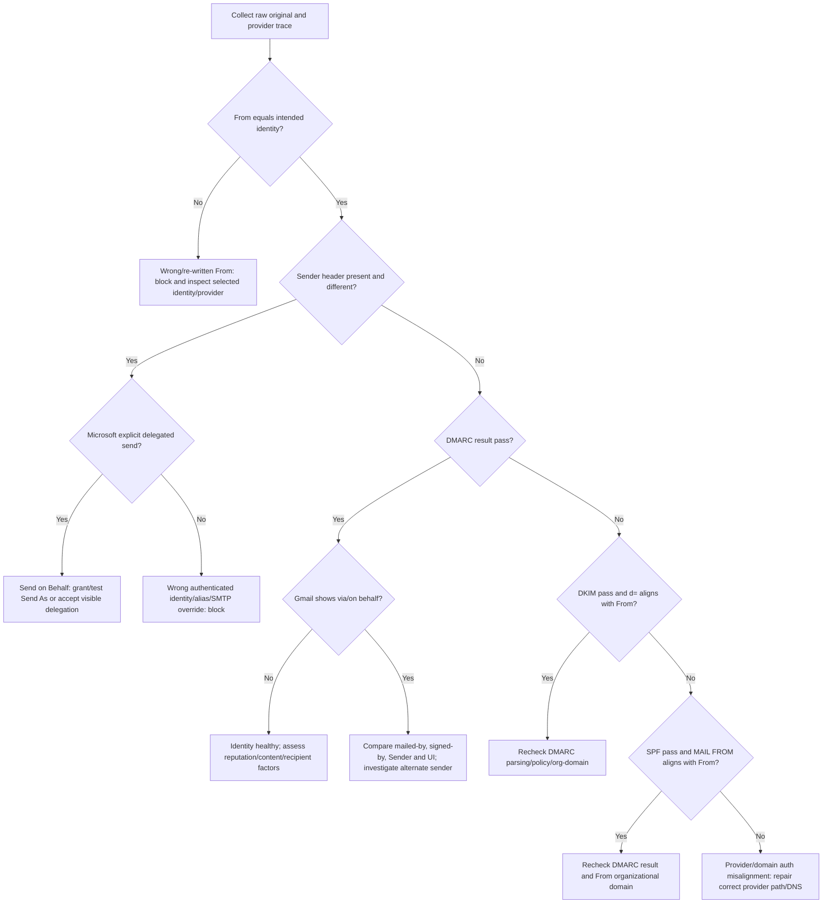

# Email test and diagnostic playbook

## Production-readiness rule

No Microsoft, Gmail, alias, shared-mailbox or generic SMTP integration is production-ready because an API/SMTP call returned success. It is ready only after the exact mailbox/identity pair passes recipient raw-header inspection, provider Sent/log correlation, reply ingestion, bounce/opt-out suppression, and duplicate-send tests.

Use controlled test domains/mailboxes and non-sensitive content. Never paste access/refresh tokens, passwords, OAuth codes, Nango secrets, full customer message bodies, or unrelated mailbox data into tickets. Redact recipient local parts only after preserving a restricted evidence copy.

Microsoft Graph and Gmail do not provide a complete sandbox that reproduces Exchange/Gmail outbound authentication, filtering, shared-mailbox permissions, recipient UI, message trace, Pub/Sub or delta/history behavior. Use real isolated Microsoft 365 and Google Workspace test tenants plus controlled recipients. Local Mailpit/MailHog-style tools are valuable for SMTP envelopes, MIME and retry tests but cannot certify public SPF/DKIM/DMARC, provider reputation, Graph/Gmail identity behavior or inbox placement.

## Evidence package for every failed test

Collect before retrying or changing configuration:

1. TG Core environment, release SHA, tenant ID, mailbox ID, sender identity ID, provider adapter and immutable send-job ID.
2. UTC send time and customer timezone; intended `From`, recipient, subject hash and content hash.
3. Authenticated provider subject: Entra tenant ID + Graph user ID/account type, Google subject, or SMTP username (restricted evidence); never the secret.
4. Provider endpoint and sanitized request shape, HTTP/SMTP status, Graph/Gmail request/correlation IDs, SMTP enhanced status, retry-after, and application egress IP.
5. Provider Sent item: provider message ID/thread/conversation ID, RFC `Message-ID`, actual `from` and `sender`, creation/sent timestamps.
6. Full raw message downloaded by the recipient, including all headers and MIME boundaries. Do not forward the message; forwarding changes headers.
7. Recipient UI screenshots showing “via,” “on behalf of,” mailed-by/signed-by or spam placement.
8. Microsoft Exchange message trace/export or Gmail Admin Email Log Search result where the customer has access.
9. DNS snapshots for `From` domain: SPF, relevant DKIM selector, DMARC, MX; record resolver and time.
10. Recent mailbox/product counts: accepted, unknown, hard/soft bounce, complaint, unsubscribe, throttle and manual activity where accessible.

The minimum raw headers are:

```text
From:
Sender:
Reply-To:
To:
Date:
Message-ID:
In-Reply-To:
References:
Return-Path:
Authentication-Results:
ARC-Authentication-Results:
Received-SPF:
DKIM-Signature:          # preserve d=, s=, h= and result; redact signature value if needed
List-Unsubscribe:
List-Unsubscribe-Post:
Received:                # every line, in original order
X-MS-Exchange-*:
X-Google-*:
X-TG-Send-Id:
Content-Type:
MIME-Version:
```

Also preserve the SMTP envelope from a controlled receiver or message trace. `Return-Path` normally reflects it, but a trace is stronger evidence.

## Microsoft 365 normal-mailbox test

### Preparation

1. Use a dedicated Microsoft 365 test tenant with a verified test domain, Exchange Online mailbox, DKIM enabled, SPF containing Microsoft 365 as documented by Microsoft, and DMARC at least monitoring.
2. Register the production-like multi-tenant Entra app in the test environment with separate client credentials/redirect URIs. Configure delegated `Mail.Send`; add `Mail.Read` only for the sync test.
3. Create controlled recipient mailboxes at Gmail and a second Microsoft tenant. Ensure no prior contact/filter distorts the first test; keep one known-inbox control too.
4. Disconnect any previous consumer Microsoft/Nango connection. Start a new connection intent and record state/tenant binding evidence.

### Execute

1. Sign in with the exact Microsoft 365 work account. Confirm the consent screen tenant and requested scopes.
2. After callback, call Graph `/me` and record `id`, tenant ID from token claims, `userPrincipalName`, `mail` and account type. The selected primary From must correspond to this mailbox.
3. Send a plain multipart diagnostic with no tracking, one direct HTTPS link, no attachment, body opt-out, RFC 8058 headers and an opaque `X-TG-Send-Id`.
4. Record the Graph request ID and `202` time. Do not call that request ID a message ID.
5. Query/synchronize Sent Items and correlate the actual provider item and RFC `Message-ID`.
6. At Gmail: open message menu → **Show original** → download/copy original. Record SPF, DKIM, DMARC, mailed-by, signed-by and any “via.”
7. At Microsoft recipient: view message source/properties and preserve the raw message.
8. Run Exchange Online message trace for the UTC time/sender/recipient. In the Exchange admin center, go to **Mail flow → Message trace**, use a narrow range, sender and recipient, then open/export detail. Preserve status, events, connector/source, recipient response, message ID and network message ID. See Microsoft’s [modern message trace guide](https://learn.microsoft.com/en-us/Exchange/monitoring/trace-an-email-message/message-trace-modern-eac).
9. Reply from each recipient. Confirm Graph notification triggers delta sync, RFC/provider IDs correlate, the enrollment stops before another step, and no unrelated message is imported.
10. Send to a controlled nonexistent address/domain and verify DSN classification/suppression without suppressing temporary failures as hard.

### Pass criteria

- `From` is the selected business mailbox; `Sender` is absent or identical.
- Gmail does not show unexplained `via outlook.com` or on-behalf representation.
- SPF and/or DKIM pass **and align** so DMARC passes; customer-domain DKIM is preferred and expected when enabled.
- Return-Path and Received chain are Microsoft-controlled; no TG Core MTA appears as recipient-facing delivery hop.
- Sent item and raw RFC ID are stored; Graph request ID remains separately labeled.
- Reply, DSN and suppression paths pass; sync recovery works after a deliberately dropped notification.

## Microsoft “on behalf of” and shared-mailbox test matrix

Create `delegate@domain.test` and `sales@domain.test` shared mailbox. Run each configuration separately and remove old permissions between cases.

| Case | Graph permission | Exchange permission | Request | Expected result |
|---|---|---|---|---|
| Normal user | `Mail.Send` | none | `/me/sendMail`, no `from` | From/Sender normal user |
| Unauthorized shared | `Mail.Send.Shared` | none | `/me/sendMail` with `from=sales@…` | `403 ErrorSendAsDenied`; no message |
| Send on Behalf | `Mail.Send.Shared` | Send on Behalf | Explicit shared `from` | `Sender=delegate`, `From=sales`; recipient can show on behalf; TG Core marketing readiness must fail |
| Send As | `Mail.Send.Shared` | Send As | Explicit shared `from` | `Sender` absent/same as `sales`; no delegate display; readiness may pass after auth checks |
| Shared endpoint | appropriate delegated rights | Full Access plus Send As/Behalf as Microsoft requires | `/users/sales@…/sendMail` | Validate Sent-copy behavior and identity separately |

For every case, collect raw headers, Graph request/error, Sent location, Exchange message trace, and recipient UI. Never “fix” Send-on-Behalf display by manually deleting/forging `Sender`; configure Send As.

## Diagnose the observed generated Outlook identity

For `outlook_434CA8BCE302C8F2@outlook.com on behalf of cerenogul@degisimmotor.com`:

1. Freeze retries and record which adapter sent the job: Microsoft Graph, generic SMTP, PlusVibe or another provider.
2. Inspect raw `Sender` and `From`. If Sender is the generated Outlook address and From is the business address, the on-behalf identity split is confirmed.
3. Inspect `Authentication-Results`, `DKIM-Signature d=`, `Return-Path` and Received chain. Record which domain SPF authenticated and whether DKIM/DMARC aligned with `degisimmotor.com`.
4. If Graph:
   - inspect the token issuer/tenant/account type and Graph `/me` ID, UPN and mail;
   - confirm the request was `/me/sendMail` and whether it included `from`;
   - inspect the Sent item’s `from`, `sender`, `internetMessageId` and parent folder;
   - run Exchange/Outlook trace. A consumer account connected through `/common` is not proof of a `degisimmotor.com` Exchange mailbox.
5. If SMTP:
   - record SMTP server, authenticated username and envelope MAIL FROM;
   - compare them with visible From;
   - repeat once with From exactly equal to the authenticated primary identity. If the generated/on-behalf display disappears, unauthorized From override is the root cause.
6. Check whether `cerenogul@degisimmotor.com` is a primary mailbox, verified alias, connected account, shared mailbox, forwarding address, or consumer Outlook “send from” alias. Check accepted-domain and Send As/Send on Behalf configuration in the actual tenant.
7. Do not change SPF/DKIM until the transport identity is understood. DNS can repair alignment but cannot turn Send on Behalf into Send As.

## Identity/authentication decision tree



Interpretation rules:

- `spf=pass` for `outlook.com` with `From: ...@degisimmotor.com` is authenticated but normally unaligned unless organizational-domain rules make them the same—which they do not here.
- `dkim=pass header.d=outlook.com` has the same non-alignment problem for a `degisimmotor.com` From. An aligned passing `d=degisimmotor.com` can make DMARC pass even when SPF is unaligned.
- A DMARC pass does not erase a distinct `Sender` or intentional Send-on-Behalf UI.
- `Return-Path` should not equal a value manually forced by TG Core. It identifies the provider envelope/bounce route.
- The earliest external `Received` hop identifies the recipient-facing sending MTA. TG Core’s IP may occur in API/provider logs without being that MTA.

## Gmail / Google Workspace test

### Preparation and connection

1. Use a separate Google Workspace test tenant and Google Cloud project/brand. Complete required OAuth verification for production scopes. Keep production and staging clients, redirect URIs, Pub/Sub topics and secrets separate.
2. Connect a Workspace user through authorization-code OAuth. Confirm the Google subject, selected Workspace account, scopes and refresh-token behavior.
3. Call Gmail `sendAs.list`; record primary identity, verified alias, and a pending/unverified alias for negative testing.

### Send and inspect

1. Build a multipart diagnostic with a unique RFC `Message-ID`, `X-TG-Send-Id`, visible and one-click unsubscribe, direct link and no tracking/attachment.
2. Send through `users.messages.send` as the primary identity; store Gmail message/thread ID and fetch the Sent copy.
3. In the recipient Gmail account, choose **Show original** and download the original ([Google instructions](https://support.google.com/mail/answer/29436?hl=en)). Record SPF, DKIM, DMARC, mailed-by, signed-by and “via.” Repeat at an Outlook recipient.
4. Repeat with a verified alias; expect its exact From and aligned authentication per the Workspace setup. Attempt pending/unverified alias; TG Core must reject before API dispatch.
5. Reply and confirm Pub/Sub notification, history cursor advancement, thread correlation, enrollment cancellation and duplicate-event idempotency.
6. Drop one notification intentionally and recover by history polling. Expire/replace a watch in the test harness and verify renewal/reconciliation.
7. Revoke OAuth access/change security state and verify refresh failure pauses rather than looping.

### Pass criteria

- Primary/verified alias only; no free-form From and no unexpected alternate sender.
- DMARC passes with aligned SPF or DKIM; unexplained `via` is absent.
- Gmail IDs, RFC ID, thread ID and history cursor are stored with correct semantics.
- Duplicate/out-of-order Pub/Sub events do not duplicate inbound records or actions.
- Watch renewal and missed-notification recovery work; stale sync pauses dependent next steps.

## Generic SMTP/IMAP test

Use at least one hosted provider test account and a controlled local Mailpit/MailHog-style SMTP sink plus a real IMAP test server such as GreenMail/Dovecot in CI. A local sink validates MIME and envelope but cannot prove public SPF/DKIM reputation.

1. Run SSRF cases: loopback, RFC 1918, link-local, IPv6 local/special, DNS rebinding simulation and public hostname. Private targets must fail before socket connection.
2. Run TLS cases: implicit TLS, STARTTLS, missing STARTTLS, expired/wrong-name/self-signed certificate, TLS downgrade and valid certificate. Production rejects invalid certificates.
3. Discover EHLO capabilities/auth mechanisms; authenticate with the supported secure method.
4. Send with `From == authenticated primary`. Record SMTP envelope MAIL FROM, RCPT responses, enhanced status and received raw message.
5. Attempt a different From without provider alias authorization. TG Core must block before submission. For an explicitly authorized alias, require diagnostic-header pass.
6. Verify provider Sent behavior and special-use folder discovery across localized folder names.
7. IMAP: first-sync baseline, new message, multiple folders, UID increment, UIDVALIDITY reset, disconnect/reconnect, IDLE notification, missed-IDLE polling and duplicate Message-ID.
8. Force persistence failure for one UID. The cursor must not advance past it unless the message is durably quarantined; recovery must ingest once.
9. Use two IMAP mailboxes with identical UID values. Their uniqueness must include mailbox, folder and UIDVALIDITY.
10. Feed RFC 3464 DSNs and common human/OOO/challenge messages. Confirm classifications and suppression actions.

## SPF, DKIM and DMARC inspection

### DNS commands

Use a known recursive resolver and record time/result. Examples:

```sh
dig +short MX degisimmotor.com
dig +short TXT degisimmotor.com
dig +short TXT _dmarc.degisimmotor.com
dig +short TXT selector1._domainkey.degisimmotor.com
dig +short TXT selector2._domainkey.degisimmotor.com
```

Selectors must come from an observed `DKIM-Signature` or provider configuration; do not guess one selector and declare DKIM missing. Parse SPF mechanisms recursively and enforce the RFC lookup budget. More than one SPF record at the same owner is invalid.

### Result matrix

| Raw result | Meaning | Action |
|---|---|---|
| SPF pass, envelope domain aligned with From | SPF can satisfy DMARC | Confirm DMARC pass and DKIM posture |
| SPF pass, envelope domain not aligned | Authenticated provider envelope but SPF cannot satisfy DMARC | Require aligned DKIM or correct provider return-path configuration |
| DKIM pass, `d=` aligned with From | DKIM can satisfy DMARC | Confirm DMARC pass and signing stability |
| DKIM pass, unrelated `d=` | Signature authentic but not DMARC-aligned | Enable customer-domain DKIM/correct sending identity |
| SPF/DKIM pass but DMARC fail | Alignment, organizational-domain, From syntax or evaluator issue | Inspect exact domains and strict/relaxed modes; block |
| DMARC `p=none`, pass | Authentication passes; policy monitors | Ready with policy-strength warning if other checks pass |
| `temperror` | Transient DNS/evaluation issue | Retry check later; do not rewrite DNS blindly |
| `permerror` | Invalid record, often multiple SPF/lookup/syntax issue | Block or warn according to whether aligned DKIM still safely passes; customer must repair |

## Gmail “via” and Microsoft “on behalf of” diagnosis

| Observation | Most likely technical meaning | Required evidence/action |
|---|---|---|
| Gmail shows “via outlook.com”; `From` business domain; signed-by/mailed-by Outlook domain | Authenticating route/domain differs from visible author | Check aligned customer DKIM/DMARC, Sender, account type and provider route |
| Raw `Sender` is delegate; `From` shared mailbox | Exchange Send on Behalf | If marketing requires shared identity, configure/test Send As; do not forge header |
| Generated `outlook_…@outlook.com` Sender | Consumer Outlook transport/alias or authenticated identity differs | Inspect token account type, `/me`, aliases, SMTP auth user and trace; reconnect correct M365 mailbox |
| SMTP raw From differs from submitted From | Provider rejected/rewrote unauthorized identity | Block identity; configure provider-authorized alias/Send As and retest |
| No distinct Sender and DMARC passes, but spam placement | Identity may be healthy; filtering may involve reputation/content/recipient history | Review volumes, list source, complaints, bounces, links/tracking, content and engagement—do not rotate IP/domain |

## Retry and duplicate-send test suite

Each scenario asserts provider-call count as well as database rows:

1. Submit the same compose request twice with one idempotency key: exactly one send job/provider call; both clients receive the same status.
2. Deliver the same queue event concurrently to two workers: one atomic lease and one provider call.
3. Crash before attempt commit: lease recovers; provider was not called; one later call.
4. Crash after attempt commit but before provider call: reconciliation sees `dispatching` without network-start evidence according to transaction model; one safe call.
5. Provider accepts and response arrives; crash before job terminal update: Sent reconciliation finds deterministic marker; no resend.
6. Provider accepts but connection times out: state becomes `unknown`; no automatic retry; Sent reconciliation resolves accepted. If inconclusive, manual review.
7. Provider rejects permanently: terminal rejected, no retry.
8. Provider throttles/temporary-fails before acceptance: bounded exponential retry with same logical job and new attempt; one eventual accepted message.
9. Database fails after provider acceptance: same as ambiguous reconciliation; no client retry-induced duplicate.
10. Campaign pauses/unsubscribe arrives after lease but before call: pre-dispatch check blocks; zero provider calls.
11. Worker lease expires during a slow provider call: a second worker cannot dispatch while attempt is in an external-call/unknown state; reconciliation owns recovery.
12. Duplicate webhook/Pub/Sub/Graph notification: one provider event and one suppression/reply action.

Exactly-once cannot be asserted by hiding ambiguous external I/O. The acceptance guarantee is: a queue/API retry does not deliberately dispatch an already-dispatched logical message; uncertain delivery is reconciled or manually reviewed before any new call.

## Bounce, reply and unsubscribe tests

- Hard: invalid mailbox, nonexistent domain and explicit 5.1.x permanent recipient status suppress exact address.
- Soft: mailbox full, temporary server issue, greylisting and 4.x statuses defer with bounded policy and do not immediately hard-suppress.
- Policy/auth: DMARC/SPF/DKIM rejection, spam/policy block and rate throttle pause the right mailbox/campaign/domain scope.
- Human reply: correct thread/enrollment stops; positive/negative stored separately.
- OOO/auto-reply: classified, does not count as positive; schedule policy can pause/resume without global suppression.
- Challenge-response: classified for review, no automated challenge interaction.
- Body opt-out, RFC 8058 POST, “unsubscribe,” “remove me,” “do not contact,” and multilingual fixtures create organization suppression and cancel all jobs.
- GET link scanner: fetching unsubscribe URL alone does not mutate state under the one-click POST design.
- Reimport/re-enrollment/another campaign cannot bypass suppression.

## Security and tenant tests

- OAuth callback with another tenant’s connection ID/state/subject is rejected and audited.
- Expired/replayed state and wrong redirect URI fail; PKCE verifier mismatch fails.
- Disconnect revokes provider grant, deletes encrypted credential, cancels watch/subscription and prevents queued sends.
- Graph validation token/client state and Gmail Pub/Sub issuer/audience/topic/project are verified; wrong values fail before side effects.
- SMTP/IMAP host cannot pivot through redirects/DNS rebinding to private networks.
- Header CR/LF/control injection attempts fail; recipients/subject/display name cannot add headers.
- Service-role data access always requires tenant context; cross-tenant mailbox/job/attachment/suppression tests fail.
- Logs contain no tokens, passwords, authorization headers, message bodies, full SMTP transcripts or sensitive URLs.
- Attachment access is private, signed, time-limited, malware/size checked and tenant-scoped.

## Production test-send checklist

### Before send

- [ ] Separate production provider/OAuth/database/storage resources are active.
- [ ] Exact mailbox/provider subject/account type and authorized identity recorded.
- [ ] Scopes are least privilege and provider review/consent requirements are complete.
- [ ] SPF/DKIM/DMARC/MX checks are current; diagnostic customer-domain DKIM expectation known.
- [ ] Tracking off; direct links; multipart text/HTML; identity/postal/opt-out present.
- [ ] Suppression, budgets, send job, immutable content and idempotency key created.
- [ ] Graph subscription/Gmail watch/IMAP sync is current when stop-on-reply is promised.

### After send

- [ ] Provider acceptance and request ID stored with correct semantics.
- [ ] Sent item/provider ID/RFC Message-ID reconciled.
- [ ] Gmail and Outlook recipient originals collected.
- [ ] From and Sender match intended behavior; no unexpected via/on-behalf display.
- [ ] SPF/DKIM/DMARC results and domains recorded and aligned.
- [ ] Return-Path/Received chain identifies expected provider outbound MTA.
- [ ] One-click POST and body opt-out suppress immediately.
- [ ] Reply sync stops next step before due time.
- [ ] Hard/soft bounce fixtures classify and apply correct action.
- [ ] Duplicate/retry/unknown-outcome tests show no second provider call.
- [ ] Provider trace and TG job timeline reconcile; alerts/dashboard show correct reason state.

Approval requires evidence from an email/platform engineer and a security reviewer. Shared-mailbox or alias support requires its own approval; passing a primary-mailbox test does not qualify other identities.
